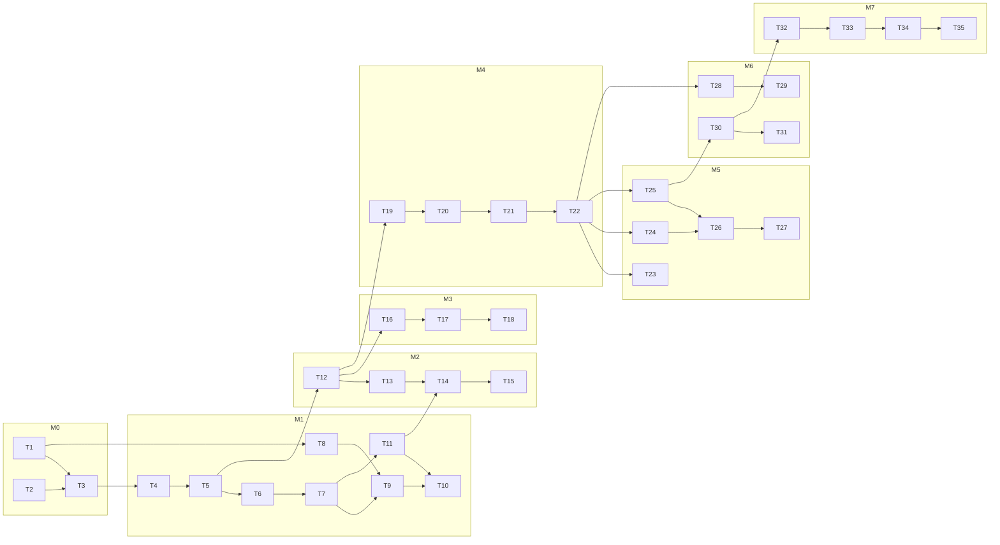

# Execution Plan — PDI · Procurement Decision Intelligence

## §A Plan header

| Field | Value |
|---|---|
| Status | approved (2026-07-09T00:00:00+05:30) |
| PRD | docs/PRD.md · shape: v3 · sha256: e5480c2c (v1.1, Appendix-B-only edit) |
| Planner | project-planning-orchestrator v1.0.0 · session model: fable (claude-fable-5) |
| Probe | scaffolded: Y · prd-to-ship: Y · devfleet: N (groups would be advisory) · tiers available: fable, opus, sonnet, haiku (assumed all four — override at Gate P) |
| Mode | fresh |

`CLAUDE_CODE_SUBAGENT_MODEL`: unset ✓ (must stay unset or all tier routing flattens).

## §B Objective & success criteria

**Objective (restated from PRD §1):** Single-tenant web platform for a wire-rope maker's category managers: file-based SAP-export + market-price ingestion → weekly demand forecasts (rolling-origin WAPE-backtested), honest P10/P50/P90 price bands (coverage-backtested), and one of five buying plays per material×plant via MILP + Monte Carlo — every recommendation terminating in an immutable, audited human decision. The system recommends; humans decide.

**Success criteria (PRD §12):** all P0 ACs pass at their tagged layers · all browser-verify ACs PASS via browser-verifier · production-readiness SHIP/SHIP-WITH-FIXES · FIX-3 walkthrough (login → breach tile → detail → approve → audit → alert ack → pilot report) zero console errors · README quickstart ≤15 min.

**Top non-goals guarding this plan:** no live SAP integration or write-back · no autonomous purchasing (nothing ever transacts) · no chat copilot / voice / mobile / multi-tenant / deep-learning forecasters / live paid feeds.

## §C Architecture & decisions

**LOCKED (PRD §4 — constraints, not choices):** PostgreSQL 16. Architectural constraints binding all tasks: API envelope `{success, data, error}` · identity from server session only · engine internal-only · integer INR money, `numeric(12,3)` MT, `DATE` business dates · run_id on every analytical row, nothing overwritten · prompts in files.

**DELEGATED decisions made by this plan** (→ PRD Appendix B on approval):

| # | Decision | Choice | Rationale (one line) | Plan impact |
|---|---|---|---|---|
| D1 | CSV/XLSX parsing library | papaparse (CSV, step-callback streaming) + exceljs streaming reader (XLSX) | Both stream ≥50k rows without OOM and surface row-level errors; battle-tested | T8 |
| D2 | DB-level decision immutability | App-layer enforcement + `UNIQUE(recommendation_id)` + `UNIQUE(idempotency_key)`; no trigger | Constraints give decide-once at the DB for free; trigger adds migration surface without adding a guarantee the app path needs | T4, T25 |
| D3 | Run orchestration shape | Web run-orchestrator calls engine stages sequentially (demand → price → recommend → alerts) against one `Run` row; engine stages are stateless per call | Matches the PRD's synchronous-run constraint; keeps engine endpoints independently testable | T11, T14, T17, T22, T28 |

**Deliberately still delegated to build time:** Recharts composition details (T15/T18/T31) · folder layout below `src/` (document in architecture.md as built) · LightGBM hyperparameters beyond the fixed deterministic config (only if backtest gates fail).

## §D Milestone & task plan

Milestones from PRD §5 verbatim, serial. Exit criteria are named AC IDs.

### M0 — Walking skeleton
**Exit criteria:** SKEL-AC1, SKEL-AC2 · **Demoable check:** `docker compose up` → `/login` renders form; `curl {ENGINE_URL}/health` → 200 `{status:"ok", db:"connected"}`

| ID | Task | ACs | cx | Tier | Layers | Depends | Files touched | Tests added | Lvl | Grp | Type |
|----|------|-----|----|------|--------|---------|---------------|-------------|-----|-----|------|
| T1 | Monorepo + Next.js shell: pnpm workspaces, apps/web with `/login` placeholder form (`data-testid="login-form"`), Tailwind + shadcn base, typecheck/lint/test scripts | SKEL-AC1 | med | sonnet | browser-verify | — | package.json, pnpm-workspace.yaml, apps/web/, packages/shared/ | apps/web smoke test | 0 | — | enabler |
| T2 | Engine skeleton: services/engine FastAPI + uv, `/health` with DB connectivity check, ENV-1 fail-fast, pytest smoke | SKEL-AC2 | low | haiku | integration | — | services/engine/ | services/engine/tests/test_health.py | 0 | — | enabler |
| T3 | Docker Compose (postgres+engine+web), `.env` wiring, fail-fast named errors on ENV-1/ENV-3 in web, ENGINE_URL plumb | SKEL-AC1, SKEL-AC2 | med | sonnet | integration, browser-verify | T1, T2 | docker-compose.yml, apps/web/src/env.ts, services/engine/src/config.py | env fail-fast tests | 1 | — | enabler |

### M1 — Auth + data in (F1, F2)
**Exit criteria:** F1-AC1..3, F1-ERR1..3, F2-AC1..4, F2-ERR1..4 · **Demoable check:** log in as buyer, `/data` shows seeded dataset status; upload FIX-5 bad CSV, see row errors

| ID | Task | ACs | cx | Tier | Layers | Depends | Files touched | Tests added | Lvl | Grp | Type |
|----|------|-----|----|------|--------|---------|---------------|-------------|-----|-----|------|
| T4 | Full DB schema E1–E17 + Drizzle migrations (uniques: PO line, market price, DecisionRecord, active-policy partial index; casing mapping) | — (enabler: unblocks T5–T35) | high | opus | unit | T3 | apps/web/src/db/schema/, drizzle config, migrations | schema constraint tests | 0 | — | enabler |
| T8 | Ingest parsing lib (D1): streamed CSV/XLSX, four header contracts, date matrix DD-MM/ISO/Excel-serial (DD-MM wins ambiguity), BOM + thousands-separator strip, ₹ rejection, row-error codes | F2-AC4 | med | sonnet | unit | T1 | packages/shared/src/ingest/ | ingest date-matrix + malformed-row tests | 0 | — | feature |
| T5 | Seed: FIX-1 users, FIX-2 36-month deterministic dataset (RNG 42, 2 plants × 3 grades × 3 suppliers), FIX-3 breach/steady tuning, default PolicyConfig, fixtures/bad_consumption.csv (FIX-5), idempotent `pnpm seed` | — (enabler: every auth'd/data AC) | high | opus | unit, integration | T4 | seed/, fixtures/ | seed determinism + idempotency tests | 1 | — | enabler |
| T6 | Auth.js v5 credentials + JWT session + middleware (matcher excludes /api/auth/* + static) + login page + role chip + sign-out + attempt logging + double-submit guard | F1-AC1, F1-AC2, F1-ERR1, F1-ERR3 | high | opus | browser-verify, integration | T4, T5 | apps/web/src/auth/, middleware.ts, app/login/, app/layout | auth integration tests | 2 | — | feature |
| T7 | Envelope + RBAC route-handler guards (401 UNAUTHENTICATED / 403 FORBIDDEN_ROLE per role matrix), applied to guarded stubs for /api/recommendations[**] | F1-AC3, F1-ERR2 | high | opus | integration | T6 | packages/shared/src/envelope.ts, apps/web/src/lib/api-guard.ts, app/api/recommendations/ | RBAC matrix tests | 3 | — | feature |
| T9 | Upload API: POST /api/uploads (multipart, 20MB cap 413) → staged batch + row errors; GET /:id; POST /:id/commit (409 on blocking errors / already committed); duplicate idempotency (PO-line + market-price keys); commit-valid-only path | F2-AC2, F2-ERR1, F2-ERR2, F2-ERR3 | high | opus | integration | T4, T7, T8 | app/api/uploads/, apps/web/src/lib/staging.ts | upload lifecycle tests | 4 | — | feature |
| T11 | Runs API + orchestrator (D3): POST /api/runs 202 + Run row, sequential engine-stage calls (stages stubbed until M2–M4, counts recorded), GET /:id polling, ENGINE_UNAVAILABLE → FAILED + retry-safe | F2-AC3, F2-ERR4 | med | sonnet | integration | T2, T7 | app/api/runs/, apps/web/src/lib/run-orchestrator.ts, services/engine stage stubs | run lifecycle + engine-down tests | 4 | — | feature |
| T10 | `/data` page: template downloads, upload drop (`data-testid="upload-drop"`), dataset status card, row-error table + commit-valid-only, trigger-run + status pill polling, failed-run retry button | F2-AC1, F2-ERR2, F2-ERR3 (browser) | med | sonnet | browser-verify | T9, T11 | app/data/, components/upload/ | — (browser layer) | 5 | — | feature |

### M2 — Demand forecasts (F3)
**Exit criteria:** F3-AC1..3, F3-ERR1..2 · **Demoable check:** trigger run on `/data`, `/forecasts?tab=demand` shows 12-week curve + WAPE badge

| ID | Task | ACs | cx | Tier | Layers | Depends | Files touched | Tests added | Lvl | Grp | Type |
|----|------|-----|----|------|--------|---------|---------------|-------------|-----|-----|------|
| T12 | Engine data layer: committed-data reads, ISO-week Monday bucketing, active-plant zero-fill vs exclusion rule | — (enabler: T13, T16, T20) | med | sonnet | unit | T5 | services/engine/src/data/ | bucketing tests | 0 | — | enabler |
| T13 | Demand models + rolling-origin backtest: seasonal-naive, ETS, deterministic LightGBM; per-fold re-fit; WAPE winner selection; LEAKAGE_GUARD; INSUFFICIENT_HISTORY (<26w) | F3-AC1, F3-AC3, F3-ERR1, F3-ERR2 | med | sonnet | unit, integration | T12 | services/engine/src/demand/ | backtest, leakage, determinism tests | 1 | — | feature |
| T14 | POST /v1/forecast/demand: persist E10 rows (run_id, model, backtestWape), run warnings, wire into run orchestrator (replace stub) | F3-AC1 | med | sonnet | integration | T13, T11 | services/engine/src/api/, run stage wiring | endpoint integration tests | 2 | — | feature |
| T15 | `/forecasts?tab=demand` UI: series selector, history+forecast chart (`demand-chart`, client-only Recharts), WAPE badge, insufficient-history chip | F3-AC2, F3-ERR1 (browser) | med | sonnet | browser-verify | T14 | app/forecasts/, components/charts/ | — (browser layer) | 3 | — | feature |

### M3 — Price bands (F4)
**Exit criteria:** F4-AC1..3, F4-ERR1..2 · **Demoable check:** `/forecasts?tab=price` shows shaded P10–P90 band + coverage stat

| ID | Task | ACs | cx | Tier | Layers | Depends | Files touched | Tests added | Lvl | Grp | Type |
|----|------|-----|----|------|--------|---------|---------------|-------------|-----|-----|------|
| T16 | Price band models: quantile LightGBM (α .1/.5/.9) on lag/momentum/volatility/calendar features, random-walk baseline + BASELINE_FALLBACK (<52w), monotonic repair + QUANTILE_REPAIRED counter, coverage + pinball backtest, leakage-safe folds | F4-AC1, F4-AC3, F4-ERR1, F4-ERR2 | med | sonnet | unit, integration | T12 | services/engine/src/price/ | quantile-crossing, coverage, determinism tests | 0 | — | feature |
| T17 | POST /v1/forecast/price: persist E11 rows (p10≤p50≤p90 invariant), run warnings, wire into orchestrator | F4-AC1 | med | sonnet | integration | T16 | services/engine/src/api/, run stage wiring | endpoint integration tests | 1 | — | feature |
| T18 | `/forecasts?tab=price` UI: shaded P10–P90 + P50 line (`price-band-chart`), coverage badge labeled "decision band", BASELINE_FALLBACK chip | F4-AC2, F4-ERR1 (browser) | med | sonnet | browser-verify | T17 | app/forecasts/, components/charts/ | — (browser layer) | 2 | — | feature |

### M4 — Recommendation engine (F5)
**Exit criteria:** F5-AC1..3, F5-ERR1..3 · **Demoable check:** POST /api/runs then GET /api/recommendations returns BUY_NOW on FIX-3 with populated rationale

| ID | Task | ACs | cx | Tier | Layers | Depends | Files touched | Tests added | Lvl | Grp | Type |
|----|------|-----|----|------|--------|---------|---------------|-------------|-----|-----|------|
| T19 | SPIKE — MILP formulation note: (Q1) exact variables/constraints for cover-≥-floor incl. open-PO arrivals, trailing-90d supplier share incl. proposal, optional WC cap, over a 12-week horizon; (Q2) infeasibility relaxation order (drop WC cap, keep cover floor) + play-classifier mapping rules. Unblocks T20–T22 | — | high | opus | — | T12 | docs/execution-plan/milp-formulation.md | — | 0 | — | spike |
| T20 | Recommendation inputs: cover computation (on-hand + open POs by delivery week), supplier offers = latest observed ± deltas, lead times, active PolicyConfig loader, trailing-share denominator in SQL | — (enabler: T21; F5-AC2 inputs) | high | opus | unit | T19 | services/engine/src/recommend/inputs.py | cover + share-denominator tests | 1 | — | enabler |
| T21 | MILP solve (OR-Tools) + seeded 500-path Monte Carlo impact + deterministic play classifier (5 plays; HEDGE_LOCK empty order lines) + rationale JSON + relaxed-solve fallback / NO_FEASIBLE_PLAN + 30s per-series timeout + solution checker | F5-AC1, F5-AC2, F5-AC3, F5-ERR1, F5-ERR3 | high | opus | unit, integration | T19, T20 | services/engine/src/recommend/ | solution-check, classifier, infeasibility, timeout tests | 2 | — | feature |
| T22 | POST /v1/recommend: persist E13, MISSING_PRICE_BAND per-series skip, expire undecided older PENDING recs on new run, wire into orchestrator; GET /api/recommendations list | F5-AC1, F5-AC3, F5-ERR2 | med | sonnet | integration | T21 | services/engine/src/api/, app/api/recommendations/ | endpoint + expiry tests | 3 | — | feature |

### M5 — Cockpit & decisions (F6) — P0 complete
**Exit criteria:** F6-AC1..3, F6-ERR1..3 **and every P0 AC from F1–F5 green in the same suite** · **Demoable check:** login → tiles → open rec → Approve → status + audit visible; re-decide blocked

| ID | Task | ACs | cx | Tier | Layers | Depends | Files touched | Tests added | Lvl | Grp | Type |
|----|------|-----|----|------|--------|---------|---------------|-------------|-----|-----|------|
| T23 | Dashboard `/`: per-series tiles (cover vs floor styling, 4w band direction, best spread, pending count), latest-run banner, alert-count slot | F6-AC1 | med | sonnet | browser-verify | T22 | app/(dashboard)/, components/tiles/ | — (browser layer) | 0 | — | feature |
| T24 | Recommendation list + detail: rationale panel rendered from **stored** JSON (inputs, drivers, constraint chips), impact P10–P90 bar, order-lines table | F6-AC2/3 (render side) | med | sonnet | browser-verify | T22 | app/recommendations/ | — (browser layer) | 0 | — | feature |
| T25 | Decision API: POST /:id/decision — action validation (note ≥10 chars for OVERRIDE/REJECT, override.play required), immutable DecisionRecord, decide-once 409 ALREADY_DECIDED, idempotency-key retry safety, status transitions | F6-AC2, F6-AC3, F6-ERR1, F6-ERR2, F6-ERR3 | high | opus | integration | T22 | app/api/recommendations/[id]/decision/ | decide-once, idempotency, validation tests | 1 | — | feature |
| T26 | Decision UI: approve/override/reject bar + confirm modals, disable-on-click, status chip flip, audit line, stale-tab 409 toast + refresh, inline NOTE_REQUIRED error, ≤10s spinner + retry | F6-AC2, F6-AC3, F6-ERR1, F6-ERR2 (browser) | med | sonnet | browser-verify | T24, T25 | app/recommendations/, components/decision/ | — (browser layer) | 2 | — | feature |
| T27 | P0 regression consolidation: single command running full unit+integration suites (web + engine) + `/verify all` P0 list, wired for the M5 exit check | — (enabler: M5 exit) | low | haiku | unit, integration | T26 | package.json scripts, CI-style runner script | — | 3 | — | enabler |

### M6 — Alerts + value (F7, F8)
**Exit criteria:** F7-AC1..2, F7-ERR1..2, F8-AC1..2, F8-ERR1..2 · **Demoable check:** `/alerts` shows seeded COVER_BREACH; `/reports/pilot` shows cumulative value line

| ID | Task | ACs | cx | Tier | Layers | Depends | Files touched | Tests added | Lvl | Grp | Type |
|----|------|-----|----|------|--------|---------|---------------|-------------|-----|-----|------|
| T28 | Alert evaluation as final run stage: COVER_BREACH / CONC_BREACH / BAND_WIDENING / PRICE_SPIKE with PRD default triggers + severity, persist E15, zero-alert runs clean | F7-AC1, F7-ERR2 | med | sonnet | integration | T22 | services/engine/src/alerts/, run stage wiring | trigger-threshold tests | 0 | — | feature |
| T29 | Alerts UI + ack: nav bell count, `/alerts` list linking to recs, ack API (409 ALREADY_ACKED) + actor/timestamp, empty state | F7-AC1, F7-AC2, F7-ERR1 | med | sonnet | browser-verify, integration | T28 | app/alerts/, app/api/alerts/, nav | ack lifecycle tests | 1 | — | feature |
| T30 | Value engine: baseline = decision-month avg committed market price × qty, plan cost from order lines, actual-PO matching (supplier+material+week ±1) → ACTUALIZED (append fields, never mutate estimates), BASELINE_UNAVAILABLE exclusion | F8-AC2, F8-ERR2 | med | sonnet | integration | T25 | apps/web/src/lib/value/ | baseline, actualization, unavailable tests | 0 | — | feature |
| T31 | `/reports/pilot`: decisions table (system vs human play, ₹ en-IN), cumulative value chart, forecast-quality panel (WAPE, coverage), adoption stats, no-decisions empty state with formula visible | F8-AC1, F8-ERR1 | med | sonnet | browser-verify | T30 | app/reports/pilot/, components/reports/ | — (browser layer) | 1 | — | feature |

### M7 — AI memo (F9) — v1 complete
**Exit criteria:** F9-AC1..2, F9-ERR1..3; full P0+P1 suite green · **Demoable check:** "Generate memo" renders memo; with ANTHROPIC_API_KEY unset, template memo + notice

| ID | Task | ACs | cx | Tier | Layers | Depends | Files touched | Tests added | Lvl | Grp | Type |
|----|------|-----|----|------|--------|---------|---------------|-------------|-----|-----|------|
| T32 | Week-aggregate assembly (aggregates only — forbidden-field scrub at boundary) + deterministic template memo + Memo storage (E17) + /api/memo route with feature flag | F9-ERR1 | med | sonnet | integration | T30 | apps/web/src/lib/memo/, app/api/memo/ | aggregate-scrub + template tests | 0 | — | feature |
| T33 | Anthropic client: MEMO_MODEL pin, prompts/ artifacts, 10s timeout + 1 retry → template fallback, zod schema validation, mode/model/latency logging, truncated invalid-payload log | F9-AC1, F9-ERR2, F9-ERR3 | high | opus | integration, unit | T32 | apps/web/src/lib/memo/client.ts, prompts/ | timeout, invalid-JSON, fallback tests | 1 | — | feature |
| T34 | Eval entrypoint (`src/lib/memo/eval-entry.ts` honoring INJECT env) + run `/evals memo` to thresholds + memo UI panel + "template mode" notice chip | F9-AC1 (browser), F9-AC2 | med | sonnet | browser-verify, evals | T33 | apps/web/src/lib/memo/eval-entry.ts, app/reports/pilot/ | — (evals + browser layers) | 2 | — | feature |
| T35 | Launch pass: full P0+P1 regression, FIX-3 walkthrough zero-console-errors, README quickstart validated ≤15 min on clean state, fix residual drift | — (enabler: PRD §12 launch criteria) | med | sonnet | unit, integration, browser-verify | T34 | (fixes only, scoped per failure) | — | 3 | — | enabler |

## §E Dependency graph



**Critical path:** T1→T3→T4→T5→T6→T7→T9→T10 ‖ →T12→T13→T14→T15→T16…→T35 — effectively a 31-task serial spine (milestones serial by contract; within-milestone independents never reach group size).

**Parallel groups:** none. Applying prd-to-ship `parallel-heuristic.md`: the only pairwise-independent same-level sets are {T4,T8}, {T9,T11}, {T23,T24}, {T28,T30} — all size 2, below the 3-task group threshold → serial. `/devfleet` absent anyway, so grouping would be advisory only.

## §F Model routing

| Tier | Model | Tasks | Count |
|------|-------|-------|-------|
| Session | fable | planning · review points in §H.3 · failure analysis · post-merge review | — |
| High | opus | T4, T5, T6, T7, T9, T19, T20, T21, T25, T33 | 10 |
| Standard | sonnet | T1, T3, T8, T10–T18, T22–T24, T26, T28–T32, T34, T35 | 23 |
| Mechanical | haiku | T2, T27 | 2 |

**Deviations from complexity defaults:**
- T4, T5 promoted to high/opus (enablers touching migrations + deterministic money data — high-floor; every downstream AC gate depends on FIX-2/FIX-3 being right)
- T19 spike at opus: MILP formulation is pure judgment
- T33 high-floor: prompt/model-code for an AI feature with eval thresholds
- T13/T16/T21 note: F3/F4 keep PRD's `medium` tag (→ sonnet) despite being the analytical core — the leakage/determinism risk is mitigated by unit gates (F3-ERR2, F4-ERR2), and the retry ladder promotes on failure; F5's core (T21) is PRD-tagged high → opus

**High-floor promotions applied:** T4 (migrations), T5 (money-data determinism), T6/T7 (authn/authz), T9 (money-data ingest state machine), T25 (irreversible decisions), T33 (AI-with-evals)
**Tier collapses (unavailable tiers):** none assumed — if opus or haiku is unavailable on your plan, say so at Gate P and the collapse table in model-routing.md applies
**Impl agents:** `.claude/agents/impl-low.md`, `impl-med.md`, `impl-high.md` written (add-only; scaffold agents untouched)
**Merge note for existing scaffold agents (proposals only — not applied):** `code-reviewer.md` → add `model: opus` (it reviews cx:high diffs) · `browser-verifier.md`, `test-runner.md`, `eval-runner.md` → add `model: sonnet` (mechanical replay; don't burn opus)
**Build session:** run `/prd-to-ship` on `fable` (or strongest available). Ensure `CLAUDE_CODE_SUBAGENT_MODEL` is unset — it would override all tier routing.

## §G Risk register & spikes

| # | Risk | L×I | Mitigation | Owner tier | Linked tasks |
|---|------|-----|------------|-----------|--------------|
| R1 | FIX-2/FIX-3 synthetic data fails the honesty gates (WAPE ≤ 0.25, coverage ∈ [0.70,0.90], deterministic BUY_NOW/WAIT) — fixture tuning couples seed and engine | H×H | Seed generator owns tunable signal/noise params; integration tests assert the gates from M2 onward so tuning happens early, not at M5 | opus | T5, T13, T16, T21 |
| R2 | MILP formulation wrong or infeasible-by-construction (cover incl. open POs, trailing-share incl. proposal, WC cap) | M×H | T19 spike settles formulation before code; F5-AC2 solution checker makes violations impossible to ship | opus | T19, T20, T21 |
| R3 | Backtest leakage inflates reported quality (per-fold re-fit, lag features at fold boundaries) | M×M | LEAKAGE_GUARD + fold-boundary unit tests written first (TDD) | sonnet | T13, T16 |
| R4 | Full run exceeds 120s on demo data (F2-AC3) with single-thread deterministic LightGBM | M×M | Measure at M2 exit; if breached, propose queue in PRD Appendix B per the delegated constraint — never add one preemptively | sonnet | T11, T14, T17, T22 |
| R5 | Auth.js v5 credentials + middleware pitfalls (login loops, matcher gaps) burn cycles | M×M | Known-pitfalls seeded; F1 ACs browser-verified immediately at T6, not deferred to M5 | opus | T6, T7 |
| R6 | Memo schema-validity < 95% or forbidden-field leakage | L×M | Schema-bound prompt + zod + template fallback; evals harness already scaffolded; aggregates-only assembly scrubbed at boundary | opus | T32, T33, T34 |
| R7 | ₹/date/BOM parsing edge cases corrupt money data silently | M×H | F2-AC4 unit matrix TDD-first in T8 before any upload path exists | sonnet | T8, T9 |

**Spikes:** T19 — answers (Q1) exact MILP variable/constraint set, (Q2) relaxation order + classifier mapping — unblocks T20, T21, T22.

## §H Verification & review plan

### §H.1 Layer routing (an AC passes only at its tagged layer)
| Layer | Command | ACs landing here |
|-------|---------|------------------|
| unit / integration | `pnpm test` · `uv run pytest` (TDD inline) + `/verify-api` smoke | SKEL-AC2 · F1-AC3, F1-ERR2/3 · F2-AC2/3/4, F2-ERR1/4 · F3-AC1/3, F3-ERR1/2 · F4-AC1/3, F4-ERR1/2 · F5-AC1/2/3, F5-ERR1/2/3 · F6-ERR3 · F7-ERR1/2 · F8-AC2, F8-ERR2 · F9-ERR1/2/3 |
| browser-verify | `/verify` (browser-verifier, dev :3000, FIX-1 sign-in) | SKEL-AC1 · F1-AC1/2, F1-ERR1 · F2-AC1, F2-ERR2/3 · F3-AC2 · F4-AC2 · F6-AC1/2/3, F6-ERR1/2 · F7-AC1/2 · F8-AC1, F8-ERR1 · F9-AC1 |
| verify-api | `/verify-api` (envelope + status contracts, web /api/* + engine /v1/*) | contract smoke for every route table in PRD §6 — runs with each milestone's integration ACs |
| evals | `/evals memo` (thresholds: schema-validity ≥ 95%, forbidden-fields 0, p95 ≤ 8s, ≤ $0.05/memo) | F9-AC2 |
| manual | — | none tagged in this PRD |

### §H.2 Review matrix
`cx: high` (T4, T5, T6, T7, T9, T20, T21, T25, T33) → plan-first paragraph + blocking review at `opus` via `/review` · `cx: med/low` → standard `/review`. Golden sets and eval thresholds are human-edit-only, at every tier.

### §H.3 Session review points (the main session engages directly — never delegated)
1. Every milestone exit check (M0–M7: exit ACs green at their layers + the demoable check run)
2. M5's compounded exit: full P0 regression (T27 command) reviewed by the session, not assumed from task greens
3. Failure analysis after any 3-strike failure (retry ladder: attempt 3 runs one tier up; after 3, session authors the analysis)
4. Any UAT/spec mismatch — stop, analyze, hand to the human (three PRD §14 TODOs are live; never resolve them)
5. R4 checkpoint at M2 exit: measure run duration; propose queue via Appendix B only if >120s

### §H.4 Evidence expectations (feeds Gate 3's evidence pack)
Web: `/verify` verdict tables + screenshots in `.claude/verify-artifacts/<AC-ID>.png` per milestone · Backend: `/verify-api` endpoint tables + pytest/vitest counts · AI: `/evals memo` metric table + cost log line · Cross-cutting: BUILD-LOG entries per task with AC IDs; launch-criteria walkthrough recording at T35.

## §I Scope counts (no time estimates — by design)

Milestones: 8 (M0–M7) · Tasks: 35 (27 feature / 7 enabler / 1 spike) · ACs covered: 51/51 (P0: 38/38) · Surfaces: web, backend, AI · Parallel groups: 0

## §J Handoff block (machine-readable — schema in handoff-contract.md)

```json
{
  "schema": "execution-plan/v1",
  "status": "approved",
  "approved_at": "2026-07-09T00:00:00+05:30",
  "prd": { "path": "docs/PRD.md", "sha256": "e5480c2cba1171531cb63d8dba2141fd339a2a4127a256d965417d61eeccd8d1", "shape": "v3" },
  "session": { "session_model": "fable", "tiers_available": ["fable", "opus", "sonnet", "haiku"] },
  "routing_defaults": { "low": "haiku", "med": "sonnet", "high": "opus" },
  "milestones": [
    { "id": "M0", "name": "Walking skeleton", "exit_acs": ["SKEL-AC1", "SKEL-AC2"], "tasks": [
      { "id": "T1", "name": "Monorepo + Next.js shell with /login placeholder", "acs": ["SKEL-AC1"], "complexity": "med", "model_tier": "sonnet", "layers": ["browser-verify"], "depends_on": [], "files_touched": ["package.json", "pnpm-workspace.yaml", "apps/web/", "packages/shared/"], "tests_added": ["apps/web/src/app/smoke.test.ts"], "level": 0, "parallel_group": null, "type": "enabler" },
      { "id": "T2", "name": "Engine skeleton: FastAPI /health + ENV fail-fast", "acs": ["SKEL-AC2"], "complexity": "low", "model_tier": "haiku", "layers": ["integration"], "depends_on": [], "files_touched": ["services/engine/"], "tests_added": ["services/engine/tests/test_health.py"], "level": 0, "parallel_group": null, "type": "enabler" },
      { "id": "T3", "name": "Docker Compose + env wiring + fail-fast", "acs": ["SKEL-AC1", "SKEL-AC2"], "complexity": "med", "model_tier": "sonnet", "layers": ["integration", "browser-verify"], "depends_on": ["T1", "T2"], "files_touched": ["docker-compose.yml", "apps/web/src/env.ts", "services/engine/src/config.py"], "tests_added": ["apps/web/src/env.test.ts"], "level": 1, "parallel_group": null, "type": "enabler" }
    ] },
    { "id": "M1", "name": "Auth + data in", "exit_acs": ["F1-AC1", "F1-AC2", "F1-AC3", "F1-ERR1", "F1-ERR2", "F1-ERR3", "F2-AC1", "F2-AC2", "F2-AC3", "F2-AC4", "F2-ERR1", "F2-ERR2", "F2-ERR3", "F2-ERR4"], "tasks": [
      { "id": "T4", "name": "Full DB schema E1-E17 + Drizzle migrations", "acs": [], "complexity": "high", "model_tier": "opus", "layers": ["unit"], "depends_on": ["T3"], "files_touched": ["apps/web/src/db/", "drizzle.config.ts"], "tests_added": ["apps/web/src/db/schema.test.ts"], "level": 0, "parallel_group": null, "type": "enabler" },
      { "id": "T8", "name": "Ingest parsing lib: streamed CSV/XLSX, date matrix, row errors", "acs": ["F2-AC4"], "complexity": "med", "model_tier": "sonnet", "layers": ["unit"], "depends_on": ["T1"], "files_touched": ["packages/shared/src/ingest/"], "tests_added": ["packages/shared/src/ingest/dates.test.ts", "packages/shared/src/ingest/parse.test.ts"], "level": 0, "parallel_group": null, "type": "feature" },
      { "id": "T5", "name": "Seed: FIX-1 users, FIX-2 dataset, FIX-3 tuning, FIX-5 file, pnpm seed", "acs": [], "complexity": "high", "model_tier": "opus", "layers": ["unit", "integration"], "depends_on": ["T4"], "files_touched": ["seed/", "fixtures/"], "tests_added": ["seed/determinism.test.ts"], "level": 1, "parallel_group": null, "type": "enabler" },
      { "id": "T6", "name": "Auth.js credentials + middleware + login + role chip", "acs": ["F1-AC1", "F1-AC2", "F1-ERR1", "F1-ERR3"], "complexity": "high", "model_tier": "opus", "layers": ["browser-verify", "integration"], "depends_on": ["T4", "T5"], "files_touched": ["apps/web/src/auth/", "apps/web/src/middleware.ts", "apps/web/src/app/login/"], "tests_added": ["apps/web/src/auth/auth.test.ts"], "level": 2, "parallel_group": null, "type": "feature" },
      { "id": "T7", "name": "Envelope + RBAC route guards + guarded rec stubs", "acs": ["F1-AC3", "F1-ERR2"], "complexity": "high", "model_tier": "opus", "layers": ["integration"], "depends_on": ["T6"], "files_touched": ["packages/shared/src/envelope.ts", "apps/web/src/lib/api-guard.ts", "apps/web/src/app/api/recommendations/"], "tests_added": ["apps/web/src/lib/api-guard.test.ts"], "level": 3, "parallel_group": null, "type": "feature" },
      { "id": "T9", "name": "Upload API: stage/validate/commit, duplicates, size cap", "acs": ["F2-AC2", "F2-ERR1", "F2-ERR2", "F2-ERR3"], "complexity": "high", "model_tier": "opus", "layers": ["integration"], "depends_on": ["T4", "T7", "T8"], "files_touched": ["apps/web/src/app/api/uploads/", "apps/web/src/lib/staging.ts"], "tests_added": ["apps/web/src/app/api/uploads/uploads.test.ts"], "level": 4, "parallel_group": null, "type": "feature" },
      { "id": "T11", "name": "Runs API + orchestrator + engine stage stubs + ENGINE_UNAVAILABLE", "acs": ["F2-AC3", "F2-ERR4"], "complexity": "med", "model_tier": "sonnet", "layers": ["integration"], "depends_on": ["T2", "T7"], "files_touched": ["apps/web/src/app/api/runs/", "apps/web/src/lib/run-orchestrator.ts", "services/engine/src/api/stubs.py"], "tests_added": ["apps/web/src/app/api/runs/runs.test.ts"], "level": 4, "parallel_group": null, "type": "feature" },
      { "id": "T10", "name": "/data page: templates, upload drop, status, errors, run trigger", "acs": ["F2-AC1", "F2-ERR2", "F2-ERR3"], "complexity": "med", "model_tier": "sonnet", "layers": ["browser-verify"], "depends_on": ["T9", "T11"], "files_touched": ["apps/web/src/app/data/", "apps/web/src/components/upload/"], "tests_added": [], "level": 5, "parallel_group": null, "type": "feature" }
    ] },
    { "id": "M2", "name": "Demand forecasts", "exit_acs": ["F3-AC1", "F3-AC2", "F3-AC3", "F3-ERR1", "F3-ERR2"], "tasks": [
      { "id": "T12", "name": "Engine data layer: reads, ISO-week bucketing, zero-fill rule", "acs": [], "complexity": "med", "model_tier": "sonnet", "layers": ["unit"], "depends_on": ["T5"], "files_touched": ["services/engine/src/data/"], "tests_added": ["services/engine/tests/test_bucketing.py"], "level": 0, "parallel_group": null, "type": "enabler" },
      { "id": "T13", "name": "Demand models + rolling-origin backtest + guards", "acs": ["F3-AC1", "F3-AC3", "F3-ERR1", "F3-ERR2"], "complexity": "med", "model_tier": "sonnet", "layers": ["unit", "integration"], "depends_on": ["T12"], "files_touched": ["services/engine/src/demand/"], "tests_added": ["services/engine/tests/test_demand_backtest.py", "services/engine/tests/test_leakage.py"], "level": 1, "parallel_group": null, "type": "feature" },
      { "id": "T14", "name": "POST /v1/forecast/demand + E10 persist + orchestrator wiring", "acs": ["F3-AC1"], "complexity": "med", "model_tier": "sonnet", "layers": ["integration"], "depends_on": ["T13", "T11"], "files_touched": ["services/engine/src/api/"], "tests_added": ["services/engine/tests/test_demand_endpoint.py"], "level": 2, "parallel_group": null, "type": "feature" },
      { "id": "T15", "name": "/forecasts demand tab: chart, WAPE badge, insufficient chip", "acs": ["F3-AC2", "F3-ERR1"], "complexity": "med", "model_tier": "sonnet", "layers": ["browser-verify"], "depends_on": ["T14"], "files_touched": ["apps/web/src/app/forecasts/", "apps/web/src/components/charts/"], "tests_added": [], "level": 3, "parallel_group": null, "type": "feature" }
    ] },
    { "id": "M3", "name": "Price bands", "exit_acs": ["F4-AC1", "F4-AC2", "F4-AC3", "F4-ERR1", "F4-ERR2"], "tasks": [
      { "id": "T16", "name": "Quantile LightGBM + RW baseline + monotonic repair + coverage backtest", "acs": ["F4-AC1", "F4-AC3", "F4-ERR1", "F4-ERR2"], "complexity": "med", "model_tier": "sonnet", "layers": ["unit", "integration"], "depends_on": ["T12"], "files_touched": ["services/engine/src/price/"], "tests_added": ["services/engine/tests/test_price_bands.py", "services/engine/tests/test_quantile_repair.py"], "level": 0, "parallel_group": null, "type": "feature" },
      { "id": "T17", "name": "POST /v1/forecast/price + E11 persist + orchestrator wiring", "acs": ["F4-AC1"], "complexity": "med", "model_tier": "sonnet", "layers": ["integration"], "depends_on": ["T16"], "files_touched": ["services/engine/src/api/"], "tests_added": ["services/engine/tests/test_price_endpoint.py"], "level": 1, "parallel_group": null, "type": "feature" },
      { "id": "T18", "name": "/forecasts price tab: shaded band, decision-band coverage badge, fallback chip", "acs": ["F4-AC2", "F4-ERR1"], "complexity": "med", "model_tier": "sonnet", "layers": ["browser-verify"], "depends_on": ["T17"], "files_touched": ["apps/web/src/app/forecasts/", "apps/web/src/components/charts/"], "tests_added": [], "level": 2, "parallel_group": null, "type": "feature" }
    ] },
    { "id": "M4", "name": "Recommendation engine", "exit_acs": ["F5-AC1", "F5-AC2", "F5-AC3", "F5-ERR1", "F5-ERR2", "F5-ERR3"], "tasks": [
      { "id": "T19", "name": "SPIKE: MILP formulation note (variables/constraints; relaxation order + classifier rules)", "acs": [], "complexity": "high", "model_tier": "opus", "layers": [], "depends_on": ["T12"], "files_touched": ["docs/execution-plan/milp-formulation.md"], "tests_added": [], "level": 0, "parallel_group": null, "type": "spike" },
      { "id": "T20", "name": "Recommendation inputs: cover w/ open POs, offers, policy, share denominator in SQL", "acs": [], "complexity": "high", "model_tier": "opus", "layers": ["unit"], "depends_on": ["T19"], "files_touched": ["services/engine/src/recommend/inputs.py"], "tests_added": ["services/engine/tests/test_cover.py", "services/engine/tests/test_share_denominator.py"], "level": 1, "parallel_group": null, "type": "enabler" },
      { "id": "T21", "name": "MILP + seeded Monte Carlo + play classifier + rationale + relaxation + timeout", "acs": ["F5-AC1", "F5-AC2", "F5-AC3", "F5-ERR1", "F5-ERR3"], "complexity": "high", "model_tier": "opus", "layers": ["unit", "integration"], "depends_on": ["T19", "T20"], "files_touched": ["services/engine/src/recommend/"], "tests_added": ["services/engine/tests/test_milp.py", "services/engine/tests/test_classifier.py"], "level": 2, "parallel_group": null, "type": "feature" },
      { "id": "T22", "name": "POST /v1/recommend + E13 persist + expiry + MISSING_PRICE_BAND + rec list API", "acs": ["F5-AC1", "F5-AC3", "F5-ERR2"], "complexity": "med", "model_tier": "sonnet", "layers": ["integration"], "depends_on": ["T21"], "files_touched": ["services/engine/src/api/", "apps/web/src/app/api/recommendations/"], "tests_added": ["services/engine/tests/test_recommend_endpoint.py"], "level": 3, "parallel_group": null, "type": "feature" }
    ] },
    { "id": "M5", "name": "Cockpit & decisions (P0 complete)", "exit_acs": ["F6-AC1", "F6-AC2", "F6-AC3", "F6-ERR1", "F6-ERR2", "F6-ERR3"], "tasks": [
      { "id": "T23", "name": "Dashboard tiles + run banner + alert slot", "acs": ["F6-AC1"], "complexity": "med", "model_tier": "sonnet", "layers": ["browser-verify"], "depends_on": ["T22"], "files_touched": ["apps/web/src/app/(dashboard)/", "apps/web/src/components/tiles/"], "tests_added": [], "level": 0, "parallel_group": null, "type": "feature" },
      { "id": "T24", "name": "Rec list + detail: stored-JSON rationale panel, impact bar, order lines", "acs": ["F6-AC2", "F6-AC3"], "complexity": "med", "model_tier": "sonnet", "layers": ["browser-verify"], "depends_on": ["T22"], "files_touched": ["apps/web/src/app/recommendations/"], "tests_added": [], "level": 0, "parallel_group": null, "type": "feature" },
      { "id": "T25", "name": "Decision API: immutable DecisionRecord, decide-once, idempotency, validation", "acs": ["F6-AC2", "F6-AC3", "F6-ERR1", "F6-ERR2", "F6-ERR3"], "complexity": "high", "model_tier": "opus", "layers": ["integration"], "depends_on": ["T22"], "files_touched": ["apps/web/src/app/api/recommendations/[id]/decision/"], "tests_added": ["apps/web/src/app/api/recommendations/decision.test.ts"], "level": 1, "parallel_group": null, "type": "feature" },
      { "id": "T26", "name": "Decision UI: bars, modals, status flip, audit line, 409 toast, inline errors", "acs": ["F6-AC2", "F6-AC3", "F6-ERR1", "F6-ERR2"], "complexity": "med", "model_tier": "sonnet", "layers": ["browser-verify"], "depends_on": ["T24", "T25"], "files_touched": ["apps/web/src/components/decision/", "apps/web/src/app/recommendations/"], "tests_added": [], "level": 2, "parallel_group": null, "type": "feature" },
      { "id": "T27", "name": "P0 regression consolidation command", "acs": [], "complexity": "low", "model_tier": "haiku", "layers": ["unit", "integration"], "depends_on": ["T26"], "files_touched": ["package.json", "scripts/regression.sh"], "tests_added": [], "level": 3, "parallel_group": null, "type": "enabler" }
    ] },
    { "id": "M6", "name": "Alerts + value", "exit_acs": ["F7-AC1", "F7-AC2", "F7-ERR1", "F7-ERR2", "F8-AC1", "F8-AC2", "F8-ERR1", "F8-ERR2"], "tasks": [
      { "id": "T28", "name": "Alert evaluation run stage: 4 types, severities, E15 persist", "acs": ["F7-AC1", "F7-ERR2"], "complexity": "med", "model_tier": "sonnet", "layers": ["integration"], "depends_on": ["T22"], "files_touched": ["services/engine/src/alerts/"], "tests_added": ["services/engine/tests/test_alerts.py"], "level": 0, "parallel_group": null, "type": "feature" },
      { "id": "T29", "name": "Alerts UI + ack API + bell count + empty state", "acs": ["F7-AC1", "F7-AC2", "F7-ERR1"], "complexity": "med", "model_tier": "sonnet", "layers": ["browser-verify", "integration"], "depends_on": ["T28"], "files_touched": ["apps/web/src/app/alerts/", "apps/web/src/app/api/alerts/"], "tests_added": ["apps/web/src/app/api/alerts/ack.test.ts"], "level": 1, "parallel_group": null, "type": "feature" },
      { "id": "T30", "name": "Value engine: baseline, plan cost, PO actualization, BASELINE_UNAVAILABLE", "acs": ["F8-AC2", "F8-ERR2"], "complexity": "med", "model_tier": "sonnet", "layers": ["integration"], "depends_on": ["T25"], "files_touched": ["apps/web/src/lib/value/"], "tests_added": ["apps/web/src/lib/value/value.test.ts"], "level": 0, "parallel_group": null, "type": "feature" },
      { "id": "T31", "name": "/reports/pilot: decisions table (en-IN), value chart, quality panel, empty state", "acs": ["F8-AC1", "F8-ERR1"], "complexity": "med", "model_tier": "sonnet", "layers": ["browser-verify"], "depends_on": ["T30"], "files_touched": ["apps/web/src/app/reports/pilot/", "apps/web/src/components/reports/"], "tests_added": [], "level": 1, "parallel_group": null, "type": "feature" }
    ] },
    { "id": "M7", "name": "AI memo (v1 complete)", "exit_acs": ["F9-AC1", "F9-AC2", "F9-ERR1", "F9-ERR2", "F9-ERR3"], "tasks": [
      { "id": "T32", "name": "Week aggregates (scrubbed) + template memo + E17 + /api/memo flag", "acs": ["F9-ERR1"], "complexity": "med", "model_tier": "sonnet", "layers": ["integration"], "depends_on": ["T30"], "files_touched": ["apps/web/src/lib/memo/", "apps/web/src/app/api/memo/"], "tests_added": ["apps/web/src/lib/memo/template.test.ts", "apps/web/src/lib/memo/scrub.test.ts"], "level": 0, "parallel_group": null, "type": "feature" },
      { "id": "T33", "name": "Anthropic client: pin, timeout+retry, zod validation, fallback, logging", "acs": ["F9-AC1", "F9-ERR2", "F9-ERR3"], "complexity": "high", "model_tier": "opus", "layers": ["integration", "unit"], "depends_on": ["T32"], "files_touched": ["apps/web/src/lib/memo/client.ts", "prompts/"], "tests_added": ["apps/web/src/lib/memo/client.test.ts"], "level": 1, "parallel_group": null, "type": "feature" },
      { "id": "T34", "name": "Eval entrypoint + /evals memo to thresholds + memo UI panel + notice chip", "acs": ["F9-AC1", "F9-AC2"], "complexity": "med", "model_tier": "sonnet", "layers": ["browser-verify", "evals"], "depends_on": ["T33"], "files_touched": ["apps/web/src/lib/memo/eval-entry.ts", "apps/web/src/app/reports/pilot/"], "tests_added": [], "level": 2, "parallel_group": null, "type": "feature" },
      { "id": "T35", "name": "Launch pass: full P0+P1 regression, FIX-3 walkthrough, README quickstart validation", "acs": [], "complexity": "med", "model_tier": "sonnet", "layers": ["unit", "integration", "browser-verify"], "depends_on": ["T34"], "files_touched": [], "tests_added": [], "level": 3, "parallel_group": null, "type": "enabler" }
    ] }
  ],
  "review_points": { "milestone_exit": "fable", "post_merge": "fable", "failure_analysis": "fable", "review_high_cx": "opus" },
  "manual_reroutes": [],
  "tier_collapses": []
}
```

## §K Execution instructions

**With prd-to-ship (recommended):** run `/prd-to-ship`. Gate 1 (PRD preflight) runs as normal. At Phase 2, this plan pre-seeds the decomposition: adopt §J's milestones/tasks/routing/groups after re-verifying the PRD sha256, run `/autoplan` (or the 3-lens fallback) over it, and present Gate 2 from §J — plan source noted as `project-planning-orchestrator`. Execute each task by delegating to its `model_tier` impl agent (`.claude/agents/impl-<tier>.md`); all prd-to-ship gates, the failure playbook, post-merge verification, and ship-state ownership remain untouched — this plan is input to Gate 2, never a bypass of it. If this plan's sha256 ≠ the PRD on disk, discard §J and re-derive (the spec moved).
